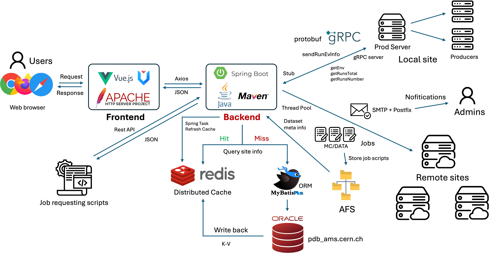

# AMS Job Requesting System (Architecture Overview)

This repository contains a high-level introduction and architecture diagram
of the **AMS Job Requesting System**, developed and maintained as part of the
Alpha Magnetic Spectrometer (AMS) experiment at CERN.

## Project Background

The **Alpha Magnetic Spectrometer (AMS)** is a high-energy particle physics experiment
deployed on the **International Space Station (ISS)**. It relies on data reconstruction
and Monte Carlo (MC) simulations for physics analysis and experimental calibration.  

The **AMS Job Requesting System** is the central entry point for AMS distributed computing.  
It manages job requests, generates simulation and reconstruction job scripts, and distributes
them to CERN local clusters as well as worldwide remote computing centers.

---

## Main Contributions & Results

- **System Refactoring and Architecture Upgrade**  
  Rebuilt the legacy **Perl + CGI** system (20k+ lines of code with performance bottlenecks)  
  into a modern architecture with **Spring Boot + MyBatis-Plus + Redis + gRPC**,  
  and upgraded the frontend to **Vue 3 + Ant Design Vue**.  
  Reduced response time from **minutes to seconds**, significantly improving maintainability and scalability.  

- **RPC Interface Migration**  
  Migrated legacy **CORBA interfaces** to **gRPC**, unifying the communication protocol,  
  reducing system coupling, and improving cross-language interoperability.  

- **Caching and Performance Optimization**  
  Designed a **Redis + scheduled refresh** caching mechanism to handle business data involving slow SQL queries and distributed file system access.  
  Unified cache management reduced frequent I/O operations, ensured data consistency,  
  and significantly increased system throughput.  

- **Distributed Concurrency Control**  
  Implemented **Redis-based distributed locks** to ensure that only one user per computing center  
  can request jobs at a time, avoiding resource conflicts and duplicate allocations.  

- **Job Generation Acceleration & Asynchronous Orchestration**  
  Combined **ThreadPoolExecutor** and **CompletableFuture** for parallel job file generation and asynchronous orchestration.  
  Eliminated single-thread bottlenecks, improving job generation speed by **4–5x**,  
  effectively supporting large-scale distributed computing.  

- **Distributed Task Scheduling & Data Transfer Optimization**  
  Integrated with the **LSF scheduling framework** to achieve parallel job submission and allocation.  
  Optimized cross-site transfer strategies to ensure efficient and stable execution of large-scale simulation workloads.  

---

## System Architecture

---

## Notes
- This repository does **not** contain production code.  
- Purpose: provide a general overview for maintainers and demonstrate system design.  
